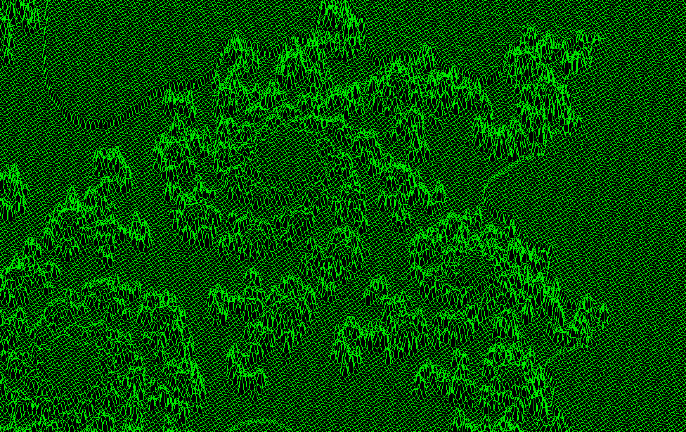

# Fdf: A wireframe graphics project

A simple wriframe visualizer. Creates a wireframe from a height map given as first argument.
Map is assumed to be correctly formatted.

## Technologies

- C
- minilibx:  a minimal graphics library for C
- Makefile

## In Action

A basic map in action

https://github.com/jboucher154/Fdf/blob/main/assets/42MapInAction.mov

